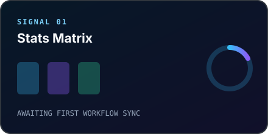
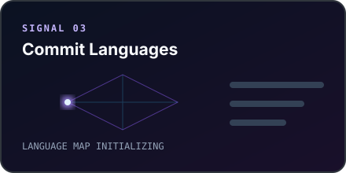
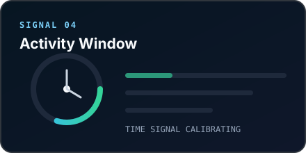

# METACORE STACK

### An open engineering lab for intelligent, secure, production-grade systems.

  
  
  

---

## GitHub Command Center

 

Animated on load · refreshed automatically every day · generated inside this repository

---

## Engineering Constellation

<table>
  <tr>
    <td width="33%" align="center" valign="top">
       
      
      <h3>Intelligence</h3>
      
Multi-agent orchestration RAG and vector intelligence Vision, speech, and predictive ML

    </td>
    <td width="34%" align="center" valign="top">
       
      
      <h3>Platforms</h3>
      
Distributed applications Real-time APIs and workflows Production full-stack systems

    </td>
    <td width="33%" align="center" valign="top">
       
      
      <h3>Resilience</h3>
      
Secure cloud architecture Containers and automation Observability and reliability

    </td>
  </tr>
</table>

---

## Flagship Systems

  
<strong>Explore the architecture behind these systems</strong>

   

  | System | Engineering signal |
  |:--|:--|
  | **[ApexAnalytics](https://github.com/metacore-stack/ApexAnalytics)** | Multi-agent financial intelligence, real-time market data, portfolio analytics, and streamed AI reasoning |
  | **[ApexDialogue](https://github.com/metacore-stack/ApexDialogue)** | Conversational AI, vector memory, background jobs, and containerized application services |
  | **[AuraVoice](https://github.com/metacore-stack/AuraVoice)** | Privacy-first on-device transcription, multilingual speech intelligence, and summarization |
  | **[HealthIntelligence](https://github.com/metacore-stack/HealthIntelligence)** | Medical imaging, clinical prediction, deep learning, and explainable AI |
  | **[Cybersecurity Intelligence Platform](https://github.com/metacore-stack/cybersecurity-intelligence-platform)** | ML-assisted vulnerability research and aviation attack-scenario simulation |

---

### BUILD BEYOND THE MODEL

*Intelligence becomes valuable when it is engineered into a dependable system.*

 

