<div align="center">



<a href="https://git.io/typing-svg">
  
</a>

<p>
  <a href="https://github.com/metacore-stack?tab=repositories"></a>
  <a href="https://github.com/metacore-stack?tab=followers"></a>
  
</p>

</div>

## `> system.identity`

**Metacore Stack** engineers intelligent systems where AI, applications, data,
and infrastructure operate as one cohesive platform.

The work here spans production AI orchestration, secure full-stack platforms,
real-time analytics, privacy-first edge intelligence, and applied machine
learning across finance, healthcare, education, and cybersecurity.

```text
MISSION  Build systems that reason, scale, and remain dependable.
METHOD   Connect research-grade intelligence to production-grade engineering.
FOCUS    AI systems · Full-stack architecture · Security · Cloud infrastructure
```

## `> core.capabilities`

| Domain | Engineering focus |
|:--|:--|
| **AI Systems** | Multi-agent orchestration, RAG, LLM applications, computer vision, speech intelligence |
| **Platform Engineering** | Python services, TypeScript applications, APIs, background processing, real-time systems |
| **Data & Intelligence** | Vector search, predictive analytics, streaming pipelines, explainable ML, visualization |
| **Security & Operations** | Secure architecture, access control, observability, containers, CI/CD, cloud deployment |

## `> technology.matrix`

<div align="center">

[](https://skillicons.dev)

</div>

## `> selected.systems`

| System | What it demonstrates | Core technologies |
|:--|:--|:--|
| **[ApexAnalytics](https://github.com/metacore-stack/ApexAnalytics)** | Multi-agent financial intelligence with real-time market analytics and portfolio workflows | LangGraph, Next.js, TypeScript, MongoDB |
| **[ApexDialogue](https://github.com/metacore-stack/ApexDialogue)** | Production conversational AI with vector search, background jobs, and containerized services | Django REST, Next.js, LangChain, pgvector, Celery |
| **[AuraVoice](https://github.com/metacore-stack/AuraVoice)** | Privacy-first, on-device meeting intelligence for transcription and summarization | Python, Whisper, Llama, edge AI |
| **[HealthIntelligence](https://github.com/metacore-stack/HealthIntelligence)** | Medical imaging and clinical prediction with explainable deep learning | PyTorch, 3D U-Net, DenseNet, SHAP |
| **[Cybersecurity Intelligence Platform](https://github.com/metacore-stack/cybersecurity-intelligence-platform)** | ML-assisted vulnerability research and aviation attack-scenario simulation | Python, machine learning, security analytics |

<div align="center">

**[View all repositories →](https://github.com/metacore-stack?tab=repositories)**

</div>

## `> live.telemetry`

<div align="center">

<picture>
  <source media="(prefers-color-scheme: dark)" srcset="https://github-stats-extended.vercel.app/api?username=metacore-stack&amp;show_icons=true&amp;hide_border=true&amp;theme=tokyonight&amp;include_all_commits=true" />
  <source media="(prefers-color-scheme: light)" srcset="https://github-stats-extended.vercel.app/api?username=metacore-stack&amp;show_icons=true&amp;hide_border=true&amp;theme=default&amp;include_all_commits=true" />
  
</picture>

<picture>
  <source media="(prefers-color-scheme: dark)" srcset="https://github-stats-extended.vercel.app/api/top-langs?username=metacore-stack&amp;layout=compact&amp;hide_border=true&amp;theme=tokyonight&amp;langs_count=8" />
  <source media="(prefers-color-scheme: light)" srcset="https://github-stats-extended.vercel.app/api/top-langs?username=metacore-stack&amp;layout=compact&amp;hide_border=true&amp;theme=default&amp;langs_count=8" />
  
</picture>

<picture>
  <source media="(prefers-color-scheme: dark)" srcset="https://streak-stats.demolab.com?user=metacore-stack&amp;theme=tokyonight&amp;hide_border=true" />
  <source media="(prefers-color-scheme: light)" srcset="https://streak-stats.demolab.com?user=metacore-stack&amp;theme=default&amp;hide_border=true" />
  
</picture>

</div>

## `> activity.signal`

<div align="center">

[](https://github.com/metacore-stack)

</div>

## `> contribution.stream`

<div align="center">

<picture>
  <source media="(prefers-color-scheme: dark)" srcset="https://raw.githubusercontent.com/metacore-stack/metacore-stack/output/github-contribution-grid-snake-dark.svg" />
  <source media="(prefers-color-scheme: light)" srcset="https://raw.githubusercontent.com/metacore-stack/metacore-stack/output/github-contribution-grid-snake.svg" />
  
</picture>

</div>

---

<div align="center">

### `INTELLIGENCE × ENGINEERING × RELIABILITY`

<sub>Building the connective layer between intelligent models and dependable software.</sub>

</div>
